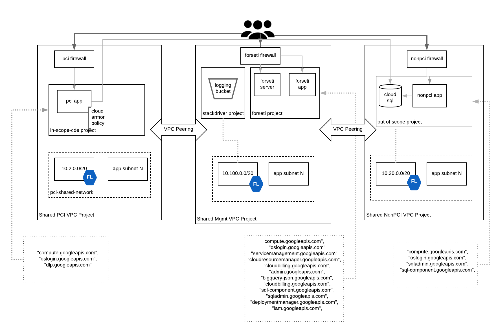

# PCI deployable architecture on GCP with Terraform
These terraform files build out an example PCI architecture in GCP. These have not been certified by a PCI DSS auditor.

## Usage
### set up TF environment
Set-up borrowed [from](https://cloud.google.com/community/tutorials/managing-gcp-projects-with-terraform) please read this for a detailed description of what is going on.
```
gcloud organizations list
gcloud beta billing accounts list
export TF_VAR_org_id=YOUR_ORG_ID
export TF_VAR_billing_account=YOUR_BILLING_ACCOUNT_ID
export TF_ADMIN=${USER}-terraform-admin
export TF_CREDS=~/.config/gcloud/${USER}-terraform-admin.json
```

Create the Terraform Admin Project
```
gcloud projects create ${TF_ADMIN} \
  --organization ${TF_VAR_org_id} \
  --set-as-default

gcloud beta billing projects link ${TF_ADMIN} \
  --billing-account ${TF_VAR_billing_account}
```

Create the Terraform service account and grant permissions
```
gcloud iam service-accounts create terraform \
  --display-name "Terraform admin account"

gcloud iam service-accounts keys create ${TF_CREDS} \
  --iam-account terraform@${TF_ADMIN}.iam.gserviceaccount.com

gcloud projects add-iam-policy-binding ${TF_ADMIN} \
  --member serviceAccount:terraform@${TF_ADMIN}.iam.gserviceaccount.com \
  --role roles/viewer

gcloud projects add-iam-policy-binding ${TF_ADMIN} \
  --member serviceAccount:terraform@${TF_ADMIN}.iam.gserviceaccount.com \
  --role roles/storage.admin

gcloud organizations add-iam-policy-binding ${TF_VAR_org_id} \
  --member serviceAccount:terraform@${TF_ADMIN}.iam.gserviceaccount.com \
  --role roles/resourcemanager.projectCreator

gcloud organizations add-iam-policy-binding ${TF_VAR_org_id} \
  --member serviceAccount:terraform@${TF_ADMIN}.iam.gserviceaccount.com \
  --role roles/billing.admin

gcloud organizations add-iam-policy-binding ${TF_VAR_org_id} \
  --member serviceAccount:terraform@${TF_ADMIN}.iam.gserviceaccount.com \
  --role roles/compute.admin

#sharedVPC
gcloud organizations add-iam-policy-binding ${TF_VAR_org_id} \
  --member serviceAccount:terraform@${TF_ADMIN}.iam.gserviceaccount.com \
  --role roles/compute.xpnAdmin

#cloudSQL
gcloud organizations add-iam-policy-binding ${TF_VAR_org_id}  \
  --member serviceAccount:terraform@${TF_ADMIN}.iam.gserviceaccount.com  \
  --role roles/cloudsql.admin

#orgadmin for foreseti IAM
gcloud organizations add-iam-policy-binding ${TF_VAR_org_id} \
  --member serviceAccount:terraform@${TF_ADMIN}.iam.gserviceaccount.com \
  --role roles/resourcemanager.organizationAdmin

#IAM for stackdriver
gcloud organizations add-iam-policy-binding ${TF_VAR_org_id} \
  --member serviceAccount:terraform@${TF_ADMIN}.iam.gserviceaccount.com \
  --role roles/logging.configWriter

# cloud armor
gcloud organizations add-iam-policy-binding ${TF_VAR_org_id} \
  --member serviceAccount:terraform@${TF_ADMIN}.iam.gserviceaccount.com \
  --role roles/compute.securityAdmin

```

Enable the following APIs
```
gcloud services enable cloudresourcemanager.googleapis.com
gcloud services enable cloudbilling.googleapis.com
gcloud services enable iam.googleapis.com
gcloud services enable compute.googleapis.com
gcloud services enable sqladmin.googleapis.com
gcloud services enable pubsub.googleapis.com
```

Set up remote state in Cloud Storage
```
gsutil mb -p ${TF_ADMIN} gs://${TF_ADMIN}

cat > backend.tf <<EOF
terraform {
 backend "gcs" {
   bucket  = "${TF_ADMIN}"
   prefix  = "terraform/state"
   project = "${TF_ADMIN}"
 }
}
EOF

gsutil versioning set on gs://${TF_ADMIN}
```
Configure your environment for the Google Cloud Terraform provider:
```
export GOOGLE_APPLICATION_CREDENTIALS=${TF_CREDS}
export GOOGLE_PROJECT=${TF_ADMIN}
```

### do some terraform!
- `terraform init` to get the plugins
- `terraform plan` to see the infrastructure plan
- `terraform apply` to apply the infrastructure build
- `terraform destroy` to destroy the built infrastructure

### Install Forseti
The instructions can be found [here](forseti/README.md)

## Requirements
### Installation Dependencies
- [Terraform](https://www.terraform.io/downloads.html)

## Architecture

- PCI Shared VPC
  * VPC peering with Non-PCI Shared VPC
  * PCI Firewall allows inbound ssh
  * Cloud Armor
    * security policy: only allow traffic from a range of ip addresses
  * In Scope CDE Project
    * 1 GCE instance is deployed which has access to Cloud SQL in the Out of Scope Project
    * Attach Cloud Armor policy to GCE instance
    * DLP API is enabled
- Non-PCI Shared VPC
  * VPC peering with PCI Shared VPC
  * Non-PCI Firewall allows inbound ssh and http
  * Out of Scope Project
    * 1 GCE instance is deployed which has access to Cloud SQL in the Out of Scope Project
    * Cloud SQL (mysql)
  * Stackdriver Project
    * GCS bucket
    * Project Level sink with a filter PCI web instance
  * Forseti Project
    * Creates Forseti service account and permissions
    * Installs Forseti

## TODO
- Add TF project & service account set-up to this doc
- Deploy a real application, not just GCE instances
- Define IAM users / groups / roles
- Need to tie everything together - alerts, monitoring, etc
- Verify logs are being written to the stackdriver bucket
- delete forseti service account once forseti has been set-up
- clean up IAM permissions for TF service account they are probably too permissive
- Configure Forseti
- Document Forseti install steps - [Module GitHub](https://github.com/terraform-google-modules/terraform-google-forseti)

## Development
### Linting
The makefile in this project will lint or sometimes just format any shell,
Python, golang, Terraform, or Dockerfiles. The linters will only be run if
the makefile finds files with the appropriate file extension.

All of the linter checks are in the default make target, so you just have to
run

```
make -s
```

The -s is for 'silent'. Successful output looks like this

```
Running shellcheck
Running flake8
Running gofmt
Running terraform validate
Running hadolint on Dockerfiles
Test passed - Verified all file Apache 2 headers
```

The linters
are as follows:
* Shell - shellcheck. Can be found in homebrew
* Python - flake8. Can be installed with 'pip install flake8'
* Golang - gofmt. gofmt comes with the standard golang installation. golang
is a compiled language so there is no standard linter.
* Terraform - terraform has a built-in linter in the 'terraform validate'
command.
* Dockerfiles - hadolint. Can be found in homebrew
